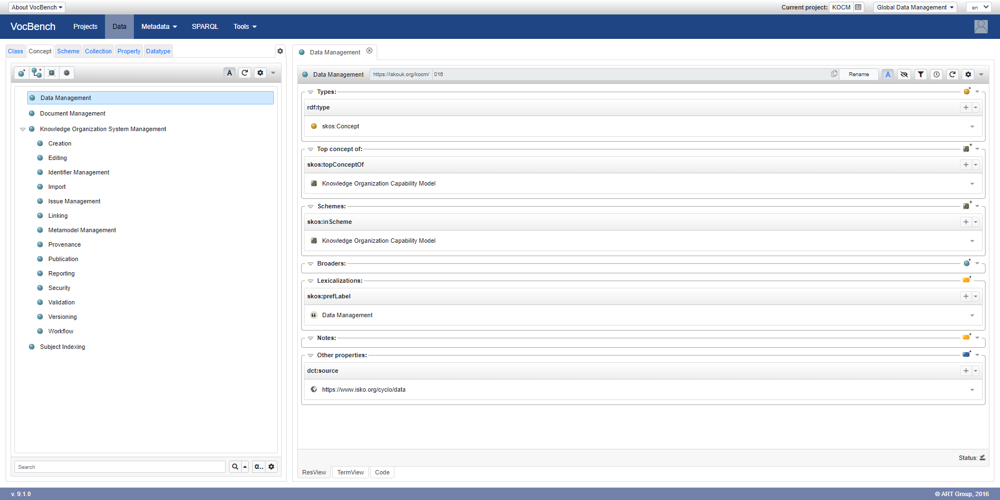

# Knowledge Organization Capability Model

Initial version of the KO Capability Model to help structure hands-on series of [ISKO UK Meetup](https://www.meetup.com/Knowledge-Organisation-London/) and organise evaluation of knowledge organization system management tools.

Fittingly, the model is published in SKOS, so you can start using it with your favourite tools.

For discussion on distinction between data and documents see https://www.isko.org/cyclo/data.

